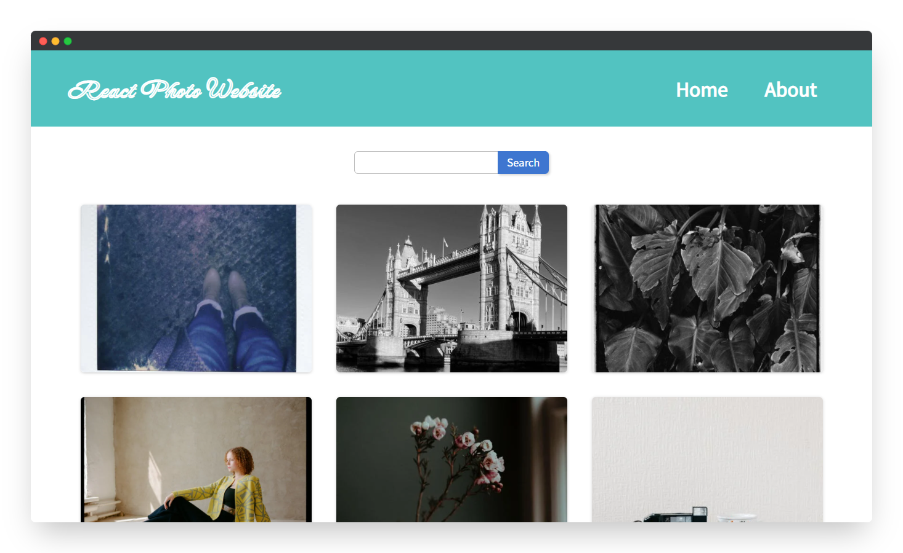
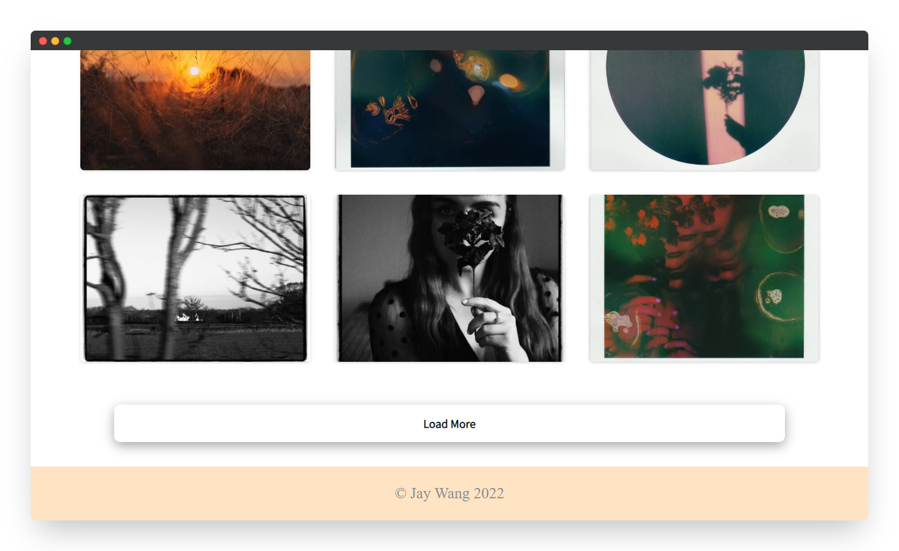
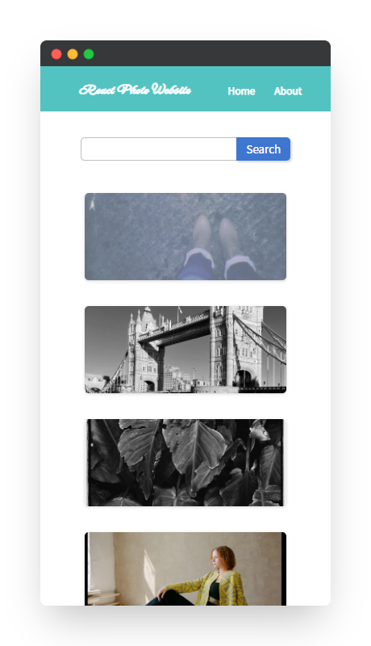
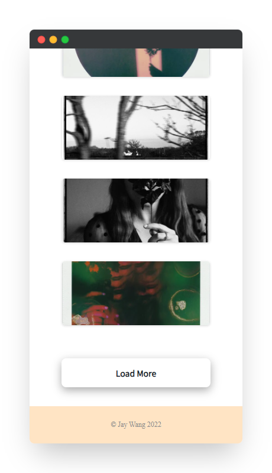

# React Photo Website

<!--
*** Thanks for checking out the React-Photo-Website. If you have a suggestion
*** that would make this better, please fork the repo and create a pull request
*** or simply open an issue with the tag "enhancement".
*** Thanks again! Now go create something AMAZING! :D
***
*** To avoid retyping too much info. Do a search and replace for the following:
*** github_username (that is "windsuzu"), repo_name (that is "React-Photo-Website"), project_title, project_description
-->

<!-- [![Issues][issues-shield]][issues-url] -->
<!-- [![PR Welcome][pr-welcome-shield]](#contributing) -->
[![Contributors][contributors-shield]][contributors-url]
[![MIT License][license-shield]][license-url]
[![Author][author-shield]][author-url]
[![LinkedIn][linkedin-shield]][linkedin-url]

<!-- PROJECT LOGO -->
 

  

  <h3 align="center">React Photo Website</h3>

  

    A photo website designed by react.js and react router.
     
    <a href="https://windsuzu.github.io/React-Photo-Website">View Demo</a>
    ·
    <a href="https://github.com/windsuzu/React-Photo-Website/issues">Report Bug</a>
    ·
    <a href="https://github.com/windsuzu/React-Photo-Website/issues">Request Feature</a>
  

Table of Contents

* [React Photo Website](#react-photo-website)
  * [About](#about)
  * [Features](#features)
  * [Preview](#preview)
  * [License](#license)
  * [Contact](#contact)
  * [Acknowledgements](#acknowledgements)

---

<!-- ABOUT THE PROJECT -->
## About

<table>
<tr>
<td>

**React Photo Website** 主要利用 React.js 及 react-router 來實作一個圖片展示、搜尋、下載的網站。 **React Photo Website** 中的所有圖片都是透過 [Pexels API](https://www.pexels.com/zh-tw/api/) 從 Pexels 下載而來。

**[DEMO]** https://windsuzu.github.io/React-Photo-Website

**Built With**:

- HTML5, CSS3, SCSS
- JavaScript ES6
- React.js / React Router
- [Pexels API](https://www.pexels.com/zh-tw/api/)

</td>
</tr>
</table>

## Features

* [導入 Pexels API 並獲取 Pexels 圖片](src/api/pexels.js)
* 設定 React Router
  * [[BrowserRouter]](https://github.com/windsuzu/React-Photo-Website/blob/main/src/index.js#L8-L10)
  * [[Routes]](https://github.com/windsuzu/React-Photo-Website/blob/main/src/App.js#L12-L15)
  * [[Link]](https://github.com/windsuzu/React-Photo-Website/blob/main/src/components/Nav.js#L9-L14)
* 搜尋圖片 & 載入圖片 (共用 fetchData)
  * [[Function]](https://github.com/windsuzu/React-Photo-Website/blob/main/src/pages/Homepage.js#L11-L18)
  * [[Picture 物件]](https://github.com/windsuzu/React-Photo-Website/blob/main/src/pages/Homepage.js#L38-L42) [[Picture 物件細節]](https://github.com/windsuzu/React-Photo-Website/blob/main/src/components/Picture.js#L1-L25)
* 初始載入圖片
  * [[useEffect]](https://github.com/windsuzu/React-Photo-Website/blob/main/src/pages/Homepage.js#L29)
* 搜尋圖片
  * [[搜尋列物件]](https://github.com/windsuzu/React-Photo-Website/blob/main/src/pages/Homepage.js#L33-L37)
  * [[搜尋列物件細節]](https://github.com/windsuzu/React-Photo-Website/blob/main/src/components/Search.js#L1-L25)
* 載入更多圖片
  * [[Function]](https://github.com/windsuzu/React-Photo-Website/blob/main/src/pages/Homepage.js#L20-L27)
  * [[載入更多按鈕物件]](https://github.com/windsuzu/React-Photo-Website/blob/main/src/pages/Homepage.js#L43-L47)
* React Github Pages Deployment
  * `npm install --save gh-pages`
  * [[package.json homepage]](https://github.com/windsuzu/React-Photo-Website/blob/main/package.json#L3) [[package.json scripts]](https://github.com/windsuzu/React-Photo-Website/blob/main/package.json#L18-L19)
  * `npm run deploy`
## Preview

  
  

  
  

---

## License

Distributed under the MIT License. See [LICENSE](https://github.com/windsuzu/React-Photo-Website/blob/main/LICENSE) for more information.

## Contact

Reach out to the maintainer at one of the following places:

* [GitHub discussions](https://github.com/windsuzu/React-Photo-Website/discussions)
* The email which is located [in GitHub profile](https://github.com/windsuzu)

## Acknowledgements

* [Wilson Ren](https://www.udemy.com/user/wilson-r-6/)

[contributors-shield]: https://img.shields.io/github/contributors/windsuzu/React-Photo-Website.svg?style=for-the-badge
[contributors-url]: https://github.com/windsuzu/React-Photo-Website/graphs/contributors
[issues-shield]: https://img.shields.io/github/issues/windsuzu/React-Photo-Website.svg?style=for-the-badge
[issues-url]: https://github.com/windsuzu/React-Photo-Website/issues
[license-shield]: https://img.shields.io/github/license/windsuzu/React-Photo-Website.svg?style=for-the-badge&label=license
[license-url]: https://github.com/windsuzu/React-Photo-Website/blob/main/LICENSE
[linkedin-shield]: https://img.shields.io/badge/-LinkedIn-black.svg?style=for-the-badge&logo=linkedin&colorB=555
[linkedin-url]: https://linkedin.com/in/windsuzu
[pr-welcome-shield]: https://shields.io/badge/PRs-Welcome-ff69b4?style=for-the-badge
[author-shield]: https://shields.io/badge/Made_with_%E2%9D%A4_by-windsuzu-F4A92F?style=for-the-badge
[author-url]: https://github.com/windsuzu
